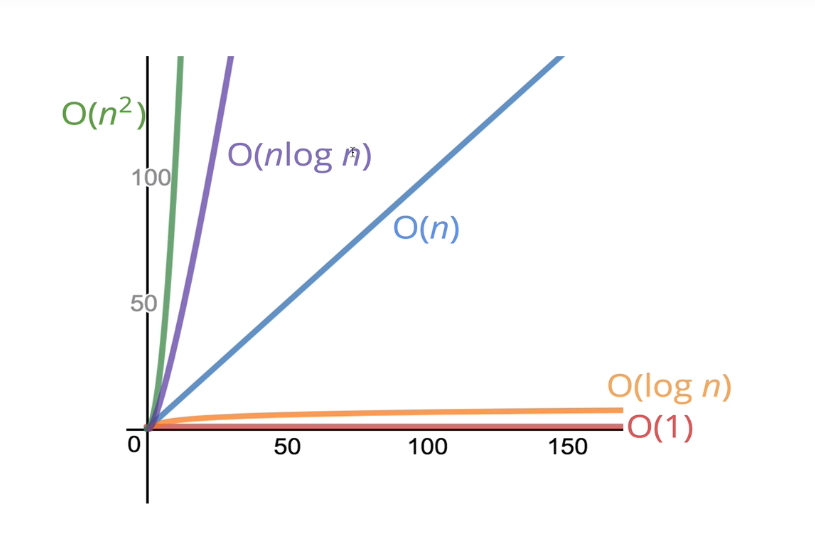

### Section 1: Big O Notation

- Big 0 Notation is a way to formalize fuzzy counting
- It allows us to talk formally about how the runtime of an algorithm grows as the input grow
- We won't care about the details, only the trends

We say that an algorithm is O(f(n)) if the number of simple operations the computer has to do is eventually less than a constant times f(n), as n increases

- f(n) could be linear (f(n)=n)
- f(n) could be quadratic (f(n)=n^2)
- f(n) could be constant (f(n)=1)
- f(n) could be something entirely different

**Ex:** Use function in https://rithmschool.github.io/function-timer-demo/ to visualize the time when n in crease.

# function addUpToFirst(n) {

var total = 0;
for (var i = 0; i <= n; i++) {
total += i;
}
return total;
}
n operation => O(n)

# function addUpToSecond(n) {

return n \* (n + 1) / 2;
}
3 operations => O(1)

# function countUpAndDown(n) {

console.log("Going up!");
for (var i = 0; i < n; i++) {
console.log(i);
}
console.log("At the top!\nGoing down...");
for (var j = n - 1; j >= 0; j--) {
console.log(j);
}
console.log("Back down. Bye!");
}
n operation => O(n)

# function printAllPairs(n) {

for (var i = 0; i < n; i++) {
for (var j = 0; j < n; j++) {
console.log(i, j);}}
}
n^2 operations => O(n^2)

## Simplifying big 0 Notation

- Constants don't matter:

  - O(2n) => O(n)
  - O(500) => O(1)
  - O(13n^2) => O(n^2)

- Smaller term don't matter:

  - O(n+10) => O(n)
  - O(1000n + 5) => O(n)

- Big O shorthands
  1. Arithmetic operations are constant
  2. Variable assignment is constant
  3. Accessing elements in an array (by index) or object (by key) is constant
  4. In a loop, the complexity is the length of the loop times the complexity of whatever happens inside of the loop

## Space Complexity

- We can use big O Notation to analyze space complexity: how much additional memory do we need to allocate in order to run the code in our algorithm?
  Auxiliary space complexity: algorithm space(not including space taken up by the inputs)
- Unless otherwise noted, when we talk about space complexity, technically we'll be talking about auxiliary space complexity.
- Rules of Thumb:
  - Most primitives are constant space.
  - String require O(n) space.
  * Reference types are generally O(n), where n is the length or number of keys.

## Logarithm
